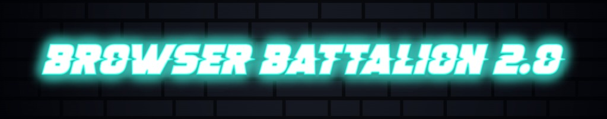
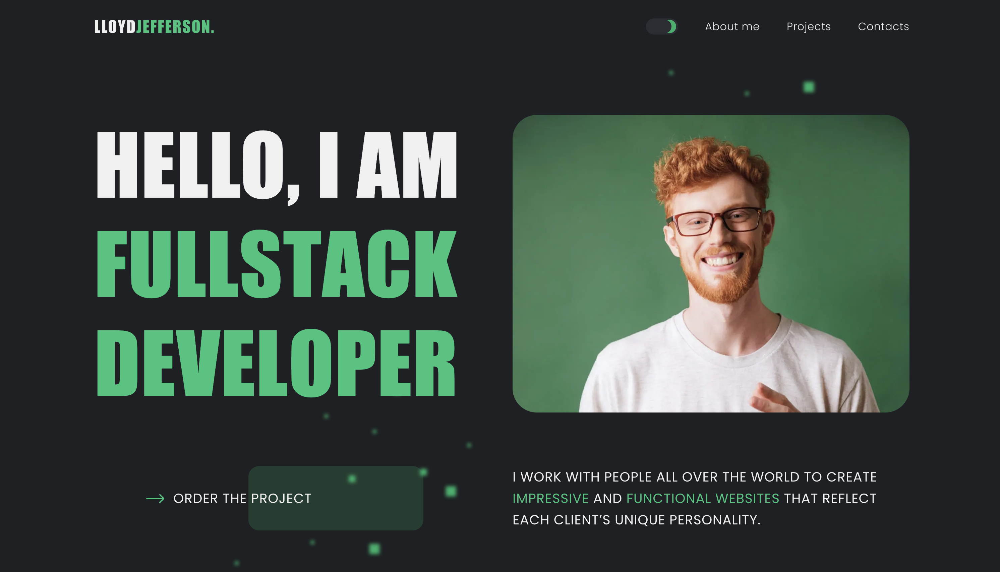

## Developer's Personal Website

This repository houses the outcome of our collaborative work on the team
project at [GoIT Academy](https://goit.global/ua/). Together, we've crafted a professional
personal website for Lloyd Jefferson, a fictional talented full-stack developer.

# About the Project

In a world where digital presence becomes a professional's calling card, we, as
GoIT students, were given a unique challenge - to build a full-fledged personal
website from scratch. This project not only allowed us to apply all the
knowledge and skills we've acquired but also taught us how to work in a team,
mirroring real-world work environments.

Our approach was to create a site for a fictional character, Lloyd Jefferson,
envisioning him as an experienced full-stack developer. This gave us the freedom
to approach design and content creatively while adhering to web development best
practices.

# Key Website Sections

- **Header**: Site navigation and theme options.
- **Home Page**: Greeting and call-to-action.
- **About Lloyd**: Biography, education, and technical skills.
- **Projects**: Portfolio gallery with descriptions.
- **Benefits**: Why work with Lloyd.
- **FAQ**: Answers to common questions.
- **Testimonials**: Client recommendations.
- **Contact**: Feedback form and information.
- **Footer**: Quick links, social media, and copyright.

# Educational Goals

1. **Applying Front-end Technologies**: From layout to server-side.
2. **Teamwork**: Role distribution, communication, Git management.
3. **Project Management**: Planning, task prioritization.
4. **Problem Solving**: Overcoming technical challenges together.

# Team Contribution

This project is the result of our talented team's collaborative efforts:

- **Teamlead**: [Viktor Hedz](https://github.com/Vikto0004) | Section: Footer;
- **Scrum Master**: [Dmytro Yevich](https://github.com/YevichDmytro) | Section:
  FAQ;
- **Front-end Developer**: [Oleg Volkoboi](https://github.com/Volki-v-boi) |
  Section: Header;

- **Front-end Developer**:
  [Anastasia Hozhelnyk](https://github.com/anastasia-hozhelnyk) | Section: Hero;
- **Front-end Developer**: [Sergii Bornosus](https://github.com/703comua) |
  Section: About Me;
- **Front-end Developer**: [Olena Rokalo](https://github.com/olenarokalo) |
  Section: Tech Skills;
- **Front-end Developer**: [Oleksandr Veselyi](https://github.com/sany0chekk) |
  Section: My Projects;
- **Front-end Developer**: [Anastasia Chala](https://github.com/AnasstasiaChala)
  | Section: Benefits;
- **Front-end Developer**: [Serhii Orlenko](https://github.com/grifano) |
  Section: Reviews;
- **Front-end Developer**: [Ihor Nikitin](https://github.com/NikitinIhor) |
  Section: Work Together;

# Tech Stack

- **Front-end**: HTML, CSS, JavaScript;
- **Additional**: GSAP, Axios, SwiperJS, Accordion-js, izitoast;
- **Bundler**: Vite;

# Our Experience at GoIT

This project represents a significant milestone in our journey at
[GoIT](https://goit.global/ua/). It served as a practical application of our
learning, allowing us to not only reinforce our technical skills but also to
experience real-world web development challenges:

- **Working with Deadlines**: We learned to manage time effectively, balancing
  different tasks to meet project timelines;
- **Code Reviews**: Regularly reviewed each other's code, offering constructive
  feedback to improve quality and learn from peers;
- **Project Presentation**: Showcased our work to mentors, practicinghow to
  articulate our decisions and process;
- **Client Feedback**: Adapted to our "client's" (teachers') wishes, simulating
  real-world client interactions;

## Looking Ahead

Completing this project, we've not only gained invaluable team experience but
also built a powerful portfolio piece. Lloyd Jefferson's site, though a
fictional character, is real-world proof of our ability to create professional
web solutions.
